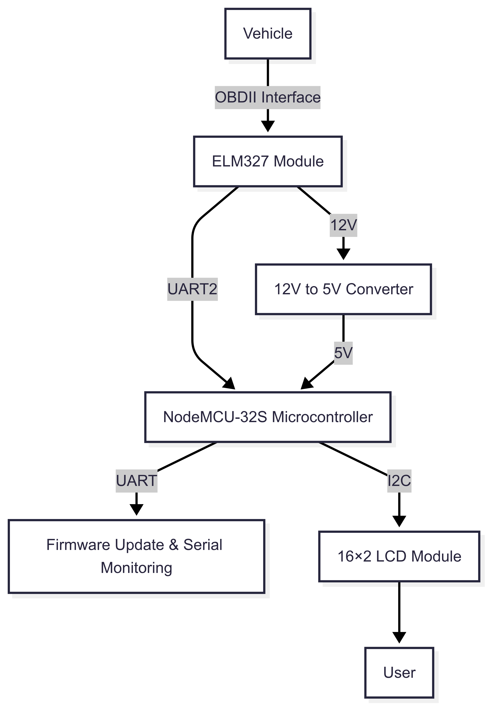
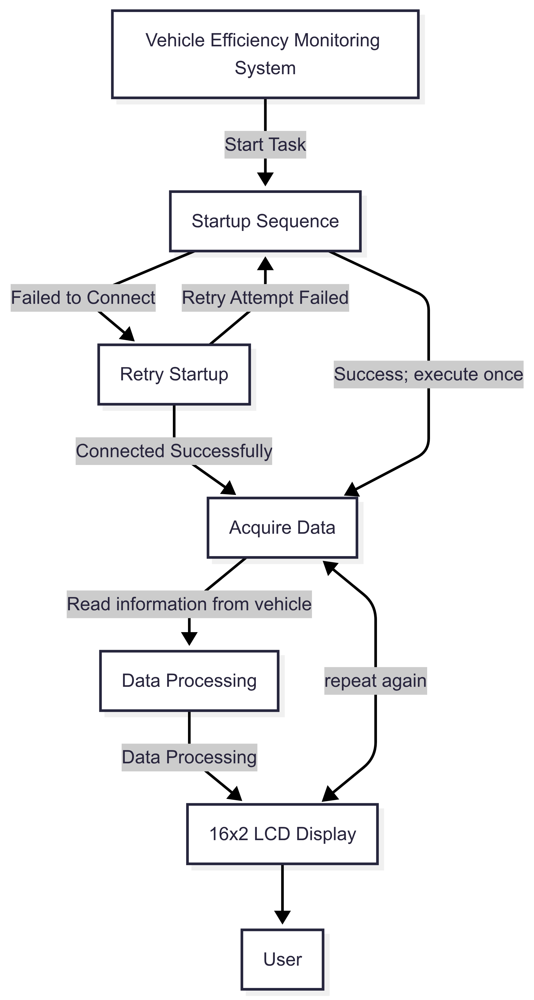

# Vehicle Efficiency Monitoring System

This is a simple, fundamental vehicle status monitoring system that captures vehicle data and calculates the current fuel consumption rate.

# Author
**Chi-Le Chien**  
Master Student, Department of Electrical Engineering, National Taipei University of Technology.  
**Po-Hao Tseng**  
Master Student, Department of Vehicle Engineering, National Taipei University of Technology.  
**Chien-Hsun Wu**  
Associate Professor, Department of Vehicle Engineering, National Taipei University of Technology.  

# Release  
| 標題1 | 標題2 | 標題3 |
|-------|-------|-------|
| 資料1 | 資料2 | 資料3 |
| 資料4 | 資料5 | 資料6 |

## Table of Contents
- [Key Features](#key-features)
- [Operation](#operation)
- [Hardware Configuration](#hardware-configuration)

## Key Features

- It is easy to add any information you want.  
- A simple reference of gasoline consumption.    
- It can be used in various vehicle data structures.  

## Principle of operation
Given the driving distance and assuming the test road is flat with no climbing, define the discrete vehicle speed as $$v$$  , and the driving time as $$t$$  .   
Therefore, we can obtain the average acceleration as $$a_{vehicle}$$ using the discrete formula:  

$$
a = \frac{v_i - v_{i-1}}{t_i - t_{i-1}}
$$  

To calculate the tire driving force, according to the principles of dynamics, the required tire driving force is:

$$
F_{tire} = (m_{vehicle}a_{vehicle})+F_{rolling}+F_{air}
$$  

Where the mass of the vehicle is denoted as **$$m_{vehicle}$$**  , the rolling resistance force as **$$F_{rolling}$$**  , and the aerodynamic force as **$$F_{air}$$**  .   
And than we can get torque of driving axle by:

$$
T_{axie} = F_{tire}r_{tire}
$$  

Where the torque of the driving axle is denoted as  **$$T_{axie}$$**  , and the radius of the tire of the driving axle is denoted as **$$r_{tire}$$**  .   
Thus, the torque of the engine can be obtained by:

$$
T_{engine} = \frac{T_{axie}}{\eta_{trans}R_{trans}}
$$  

Where the efficiency of the transmission is denoted as **$$\eta_{trans}$$**  , and the transmission ratio is denoted as **$$r_{trans}$$**  .   
Therefore, we can obtain the fuel consumption formula in grams:

$$
FC_{gram} =**\Sigma**\frac{\omega_{engine}*T_{engine}*BSFC}{{(sectohour)(WtokW)}}
$$  

Where the engine speed is denoted as **$$\omega_{engine}$$**  , the vaule of **BSFC** is denoted as **$${BSFC}$$**  , the coefficient for converting **$${SectoHour}$$** is 3600  , and **$${WtokW}$$** is 1000  .     
Then we can obtain the fuel consumption formula in liters:

$$
FC_{liter} =\frac{FC_{gram}}{\rho *{(mLtoL)}}
$$  

## Hardware Configuration
  * main microcontroller:NodeMCU-32S(you can choose any what you like).
  * 12V to 5V convert module.
  * Vehicle BUS module(This repository uses an ELM327 module because our research target is a scooter, so it needs to be flexible.)
  * Display module(This repository uses a 16x2 LCD.)

<pre>
               |----->|IN  12V convert to    |   DC 5V   |                      |
               |      |      5V module    OUT|---------->|VIN         N         |
           DC  |                                         |            o         |   
           12V |                                         |            d         |    >-------->|VCC                  |
               |                                         |            e      SCL|------------->|SCL  16X2 LCD display|
               |                                         |            M      SDA|------------->|SDA  I2C protocol    |
OBD II     |   |   |ELM327      UART|                    |            C         |    >-------->|Gnd                  |
Diagnostic |<----->|Interpreter   TX|<------------------>|Serial2.RX  U         |
Interface  |       |Module        RX|<------------------>|Serial2.TX  -         |
                                                         |            3         |
                                                         |            2         |
                                                         |            S         |
</pre>                                                   

# Architecture
This system is implemented based on the concept of FreeRTOS and is mainly divided into three tasks:
 1. **System Initialization Task**: This task is responsible for initializing all system components, ensuring that they are ready to operate (e.g., ELM327, MCU, LCD). 
 2. **Data Acquisition Task**: This task is responsible for acquiring vehicle information and sending it to the next task.   
 3. **Data Processing Task**: This task is responsible for decoding data from the previous task and displaying the fuel consumption in liters after calculation.
 

# Communication

