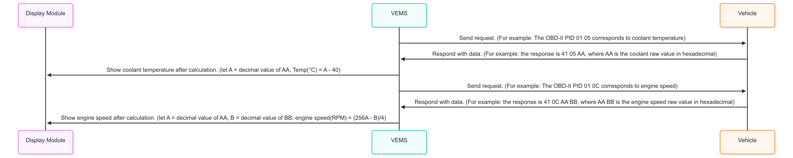

# Vehicle Efficiency Monitoring System
A fundamental vehicle status monitoring platform is developed to capture real-time vehicle operational data and evaluate instantaneous fuel consumption. By acquiring vehicle speed and engine revolutions, the system computes velocity changes across defined time intervals and estimates engine output torque. The derived torque and engine speed are then mapped to the corresponding Brake Specific Fuel Consumption (BSFC) using BSFC charts, which facilitates precise calculation of fuel consumed during each discrete sampling period.

## Table of Contents
- [Key Features](#key-features)
- [Principle of operation](#principle-of-operation)
- [Hardware Configuration](#hardware-configuration)
- [Software Architecture](#software-architecture)
- [Communication](#communication)

## Key Features

- It is easy to add any information you want.  
- A simple reference of gasoline consumption.    
- It can be used in various vehicle data structures.  

## Principle of operation
Given the driving distance and assuming the test road is flat with no climbing, define the discrete vehicle speed as $$v$$  , and the driving time as $$t$$  .   
Therefore, we can obtain the average acceleration as $$a_{vehicle}$$ using the discrete formula:  

$$
a = \frac{v_i - v_{i-1}}{t_i - t_{i-1}}
$$  

To calculate the tire driving force, according to the principles of dynamics, the required tire driving force is:

$$
F_{tire} = (m_{vehicle}a_{vehicle})+F_{rolling}+F_{air}
$$  

Where the mass of the vehicle is denoted as **$$m_{vehicle}$$**  , the rolling resistance force as **$$F_{rolling}$$**  , and the aerodynamic force as **$$F_{air}$$**  .   
And than we can get torque of driving axle by:

$$
T_{axie} = F_{tire}r_{tire}
$$  

Where the torque of the driving axle is denoted as  **$$T_{axie}$$**  , and the radius of the tire of the driving axle is denoted as **$$r_{tire}$$**  .   
Thus, the torque of the engine can be obtained by:

$$
T_{engine} = \frac{T_{axie}}{\eta_{trans}R_{trans}}
$$  

Where the efficiency of the transmission is denoted as **$$\eta_{trans}$$**  , and the transmission ratio is denoted as **$$r_{trans}$$**  .   
Therefore, we can obtain the fuel consumption formula in grams:

$$
FC_{gram} =**\Sigma**\frac{\omega_{engine}*T_{engine}*BSFC}{{(sectohour)(WtokW)}}
$$  

Where the engine speed is denoted as **$$\omega_{engine}$$**  , the vaule of **BSFC** is denoted as **$${BSFC}$$**  , the coefficient for converting **$${SectoHour}$$** is 3600  , and **$${WtokW}$$** is 1000  .     
Then we can obtain the fuel consumption formula in liters:

$$
FC_{liter} =\frac{FC_{gram}}{\rho *{(mLtoL)}}
$$  

## Hardware Configuration
  * main microcontroller:NodeMCU-32S(you can choose any what you like).
  * 12V to 5V convert module.
  * Vehicle BUS module(This repository uses an ELM327 module because our research target is a scooter, so it needs to be flexible.)
  * Display module(This repository uses a 16x2 LCD.)

<pre>
               |----->|IN  12V convert to    |   DC 5V   |                      |
               |      |      5V module    OUT|---------->|VIN         N         |
           DC  |                                         |            o         |   
           12V |                                         |            d         |    >-------->|VCC                  |
               |                                         |            e      SCL|------------->|SCL  16X2 LCD display|
               |                                         |            M      SDA|------------->|SDA  I2C protocol    |
OBD II     |   |   |ELM327      UART|                    |            C         |    >-------->|Gnd                  |
Diagnostic |<----->|Interpreter   TX|<------------------>|Serial2.RX  U         |
Interface  |       |Module        RX|<------------------>|Serial2.TX  -         |
                                                         |            3         |
                                                         |            2         |
                                                         |            S         |
</pre>                                                   

    

# Software Architecture
This system is implemented based on the concept of FreeRTOS and is mainly divided into three tasks:
 1. **System Initialization Task**: This task is responsible for initializing all system components, ensuring that they are ready to operate (e.g., ELM327, MCU, LCD). 
 2. **Data Acquisition Task**: This task is responsible for acquiring vehicle information and sending it to the next task.   
 3. **Data Processing Task**: This task is responsible for decoding data from the previous task and displaying the fuel consumption in liters after calculation.

    

# Communication
This system uses **ELM327 module** through the OBDII interface to acquire vehicle information. The specific way it is:  
 1.  VEMS send a command to ELM327 module(for example: The OBD-II PID 01 05 this command is acquire vehicle current coolant temperature) and ELM327 module will be interpreter and send a request to vehicle through OBDII interface.  
 2.  receives a request, vehicle will respond with specific information to VEMS system. For example: vehicle will return 41 05 AA, where AA is the coolant raw value.  
 3.  VEMS system will show coolant temperature after decoding and calculation.  

    

